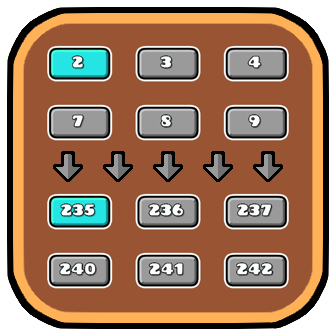

# Shifted Color Slots
A simple Geometry Dash (Geode) mod allowing you to shift the 1-9 color buttons in `[Edit Object]` by a configurable amount.



See [about.md](about.md) for configuration and caveats.

I made this due to my strong muscle memory of colors 1-9, to comfortably build in collab parts that give a color offset.

## Build instructions
For more info, see [Geode's docs](https://docs.geode-sdk.org/getting-started/create-mod#build)
```sh
# Assuming you have the Geode CLI set up already
geode build
```

# Resources
* [Geode SDK Documentation](https://docs.geode-sdk.org/)
* [Geode SDK Source Code](https://github.com/geode-sdk/geode/)
* [Geode CLI](https://github.com/geode-sdk/cli)
* [Bindings](https://github.com/geode-sdk/bindings/)
* [Dev Tools](https://github.com/geode-sdk/DevTools)
